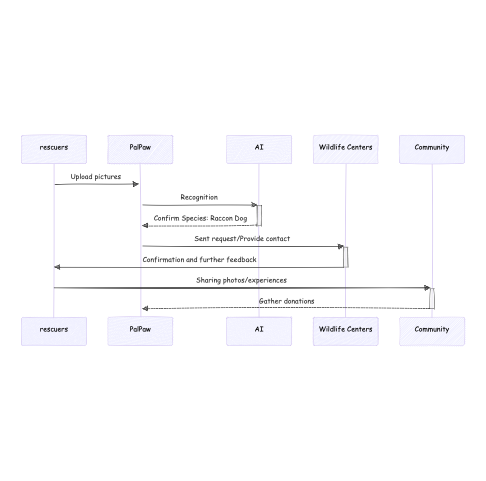
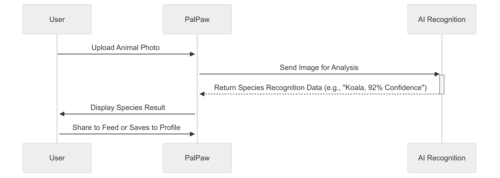
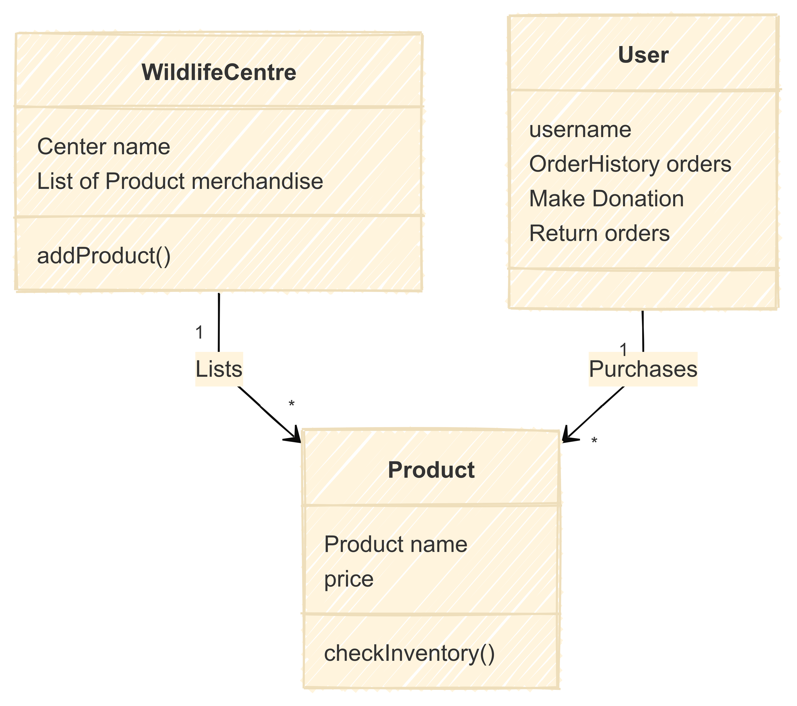
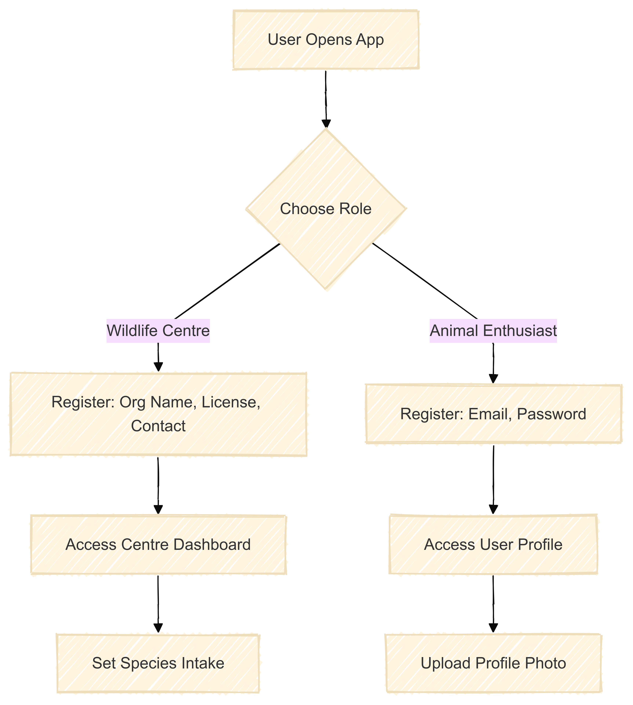
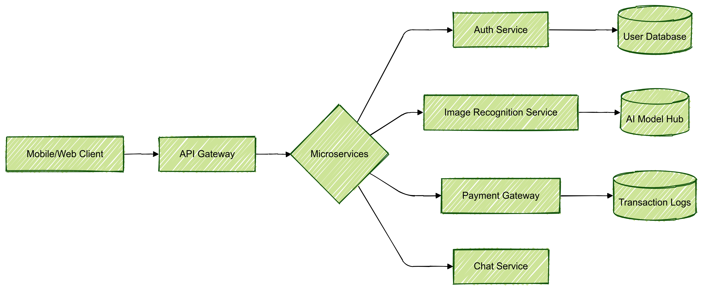

\# PalPaw: ​​The Intelligent Lifeline for Animal Rescue & Community

\#\#\#\# Q1: What are you planning to build?

PalPaw is an AI-driven unified animal conservation platform designed to turns wildlife observations into actionable rescue missions, a community-powered protection network, and sustainable funding streams for wildlife centers through photo recognition, gamified engagement, and an impact-driven e-commerce model.

### Problems We Address:
#### [The Broken Protection Chain]
From awareness to recognition to match to centers to action, key steps are often disconnected
#### [Species Identification Barrier]
Rescuers struggle to identify animals, leading to ineffective or delayed interventions
#### [Conservation Resource Misaligned]
Limited information and inefficient processes make it hard to connect with the right wildlife centers in time

Millions of animals around the world need a second chance—whether it’s finding a loving home, receiving critical medical care, or simply getting more visibility. Our project seeks to bridge animal enthusiasts and wildlife centres together as a community focused on wildlifes and pets to make helping animals easier and more impactful.
When attempting to rescue wildlife, volunteers frequently face obstacles. Recognizing the species is a common challenge; without accurate identification, it’s difficult to deliver appropriate care. Furthermore, connecting with a suitable wildlife center often involves a time-consuming search. Rescuers must sift through various sources and contact multiple organizations before finding one that can help. These inefficiencies mean that many rescuers struggle to find reliable, consolidated resources.

PalPaw addresses these challenges. By providing an integrated, user-friendly platform, it streamlines the rescue process, from identifying an animal to matching it with the best wildlife center, to eliminating the need for lengthy searches. PalPaw also fosters community engagement, enabling users to post lost-pet notices, share adoption opportunities, gain badges from seasonal photography events, and contribute to a network of animal enthusiasts. For rescue centers, PalPaw serves as a central hub for donations, volunteer recruitment, knowledge-sharing, and even sharing engaging daily content. This convenience appeals not only to individual animal lovers but also to wildlife rescue centers to get help externally.

Beyond its core rescue functionality, PalPaw also facilitates a welcoming and attractive environment for animal lovers to share their stories, exchange tips and experiences with their loved animals, and seek help. It is a platform where users can enjoy lighthearted content such as charming cat photos and heartwarming adoption stories, while also contributing to meaningful conservation efforts.

### Key Differentiation:
Unlike generic photo-sharing community or standalone donation platforms, PalPaw creates a closed-loop ecosystem where:
1. User actions can directly trigger wildlife center workflows
2. Community-Powered Contributions: knowledge-sharing and adoption postings are driven by the community
3. Transparent Support: Donors and volunteers enjoy a direct, visible impact on rescue efforts.
4. Fun Photography 

### Key Features:
#### Smart Wildlife Photography Recognition Tools: 
provide instant recognition of animals in uploaded photos during the wildlife rescue process.
#### Wildlife-Centric Resource Management: 
Species-Specific Intake Control which allows centers to define accepted species to optimize capacity; 
Pop-up volunteer ads, conservation posts, and adopter’s chat rooms; 
Search/filter wildlife centers by location, distance, and capacity.
#### Adoption Network:
Open Adoption which allows users to post/browse animal adoption opportunities.
#### Community-driven Support Channel to Wildlife Center: 
Users can support centers via donations, bookmark center profiles for updates.
#### Content Ecosystem: 
Users can share pet/wildlife photos, lost/found alerts, or stories, also can like, comment, and keyword-filter posts when browsing contents;
Seasonal photography events with profile badges to boost participation
#### Integrated E-Commerce:
PalPaw embeds merchandising stores for centers that sell branded goods, for users to purchase to support causes. 
Animal enthusiasts can also register as sellers to create their own store, and handle buyer chats or order returns.

### Example Use Cases:
#### [Wildlife Rescue]
A volunteer stumbles upon an injured gray and black small-to-medium size animal in a nearby park. Unsure if it’s a raccoon or a raccoon dog, or the proper care it needs, the volunteer uses PalPaw’s animal recognition tool by uploading a picture she takes to confirm it is a raccoon dog. Instantly, PalPaw recommends a list of available wildlife center options with addresses. With just a few clicks, the volunteer directly connects to the center or gets their contact information, and schedules a transfer.

#### [A Pet Owner Searches for Lost Pet]
A pet owner’s cat has gone missing. The pet owner posts a detailed ‘lost pet’ notice.Other users in the nearby community noticed this post. Within a day, someone recognizes the cat based on the information the owner provided in the post, and replies to the pet owner that the cat is currently in the garage. The pet wonder get reunited with her cat quickly with the animal lover network and the easy communication.

#### [A Wildlife Rescue Center Searches for Volunteers]
A wildlife rescue center currently needs more volunteers to handle the increasing amount of injured animals during this harsh winter. They post a recruit for volunteers on PalPaw with listed work content. Several animal enthusiasts who browse the volunteer opportunity board and see the call sign up to volunteer. The rescue center gains help directly from those who really care about the animals, and the volunteers receive valuable experiences in wildlife care.

#### [A Pet Owner Purchases Pet Supplies] 
A pet owner would like to buy some new cat snacks which were recommended by other cat owners in PalPaw community. The pet owner smoothly goes to the pet-supplies store and filters products for cat snacks only. After placing the order in the PalPaw store, the snacks were delivered successfully and ready for the cat to enjoy.

[User Registration FLow]

[System Architecture]

\#\#\#\# Q2: Who are your target users? (2-3 personas)

See in the pdf:
https://github.com/UTSC-CSCC01-Software-Engineering-I/term-group-project-c01w25-project-palpaw/blob/main/doc/sprint0/Persona.pdf

\#\#\#\# Q3: Why would your users choose your product? What are they using today to solve their problem/need?

### Core User Problem/Need:
Wildlife protection faces severe challenges due to lack of awareness, habitat destruction, and insufficient public engagement. Many people are unaware of how to help, and wildlife rescue centers struggle to reach potential supporters, volunteers, and donors. There is no unified platform to educate, connect, and mobilize communities for animal protection efforts.

Solution: PalPaw – Awakening Awareness for Animal Protection
PalPaw will be a community-driven platform dedicated to raising public awareness of animal conservation. It will offer educational content, a social network for sharing wildlife-related information, and tools to support wildlife rescue and adoption.
Plan for a Viable Solution

### 1 Raising Awareness Through Education
Feature: Provide educational content to help users understand animal protection issues.
Implementation:
- Blog posts, videos, and infographics on conservation efforts.
- Interactive quizzes and challenges to engage users.
- Expert-hosted webinars and live Q&A sessions.
### 2 Connecting Wildlife Centers with the Community
Feature: Allow Wildlife Centers to share their missions and interact with users.
Implementation:
- Wildlife Centers can create educational posts.
- “Species We Accept” feature to guide people on where to send rescued animals.
- Chat rooms for real-time discussions between rescuers and wildlife centers.
- Volunteer recruitment system with notifications for new opportunities.
### 3 Encouraging Action – Donations & Volunteering
Feature: Make it easy for users to support animal conservation financially and physically.
Implementation:
- In-app donation system for Wildlife Centers.
- Volunteer sign-up with location-based recommendations.
- Tracking system for users to see their impact (e.g., “You have helped 10 animals through your donations”).
### 4 Community Engagement & Social Awareness
Feature: Create a space where users can share, discuss, and spread awareness.
Implementation:
- User-generated posts about animal rescues, conservation stories, and eco-friendly tips.
- Like, comment, and share systems to increase visibility of important topics.
- Option to “favorite” Wildlife Centers and receive updates.
### 5 Wildlife Identification & Rescue Support
Feature: Help users identify and report endangered species.
Implementation:
- AI-powered image recognition to identify wildlife species.
- Direct reporting system to notify nearby Wildlife Centers.
- Map of rescue centers for users seeking help.
### 6 E-Commerce Integration
Feature: Provide an online marketplace for pet-related products and donations.
Implementation:
- Product catalog with search/filter options.
- In-app shopping and checkout.
- Secure payment gateway for purchases and donations.
- Donation tracking for Wildlife Centres.
### 7 Rescue & Adoption Support
Feature: Facilitate connections between rescuers and wildlife centers.
Implementation:
- Display a list of Wildlife Centres by location.
- Chat support for users seeking guidance.
- Adoption request system for Wildlife Centres.
### 8 Push Notifications to Keep Users Engaged
Feature: Keep users informed and involved with conservation updates.
Implementation:
- Alerts for new educational content, wildlife rescues, and volunteer opportunities.
- Notifications for donation impact updates (e.g., “Your donation helped rescue an injured fox!”).

### Conclusion:
PalPaw will raise awareness, educate, and mobilize action for animal protection. By combining education, community engagement, and direct support for Wildlife Centers, it will bridge the gap between awareness and action, making conservation accessible and impactful for everyone.

\#\#\#\# Q4: What does "DONE" means to your Team  

- All the tasks of the user story have been implemented
- The feature of the user stories work as expected, and the user could achieve the intended purpose
- All interactions, animation, or visual feedback behave as designed and aesthetic
- The feature has been manually tested in a production-like environment
- The user story is integrated with other parts of the system and tested for conflicts
- The user story has been tested and merged into develop branch through a pull request
- Code is clean, maintainable with proper comments
- Code is documented when there is complex logic or API endpoints, or hard-to-read code
- Peer reviewed or completed code reviews
- Relevant information for deployment (e.g. dependencies) is documented and informed other team members(stakeholders)

\#\#\# Highlights

### Why not other Alternatives?
We confirmed our product on the first day once the team was formed. Although we didn’t spend too much time in getting the ideal idea, we still considered alternatives such as financial SaaS platform that allows users to better manage their financial details through tracking and categorizing transactions, online shopping platform, or a project planner that integrated calendar, to-do list, and EisenHower Matrix features. However, they share a common characteristic that they are not unique enough. Building projects like these can easily fall into imitation of similar products. Additionally,our team wants to build a product that is more creative and could provide actual solutions to real-life problems.

### Key Decisions 1: Build A Wildlife Rescue Application
At the beginning, inspired by the real experience during recurring 3 raccoons. We decided to build an application aimed to streamline the time-consuming process from connecting the available wildlife center. This idea was endorsed by everyone in the team immediately once introduced because it provides a niche solution clearly targeting the in-demand wildlife protection, and even became more solid after deciding to add an AI-dirven animal recognition tool as advised by one of our TAs. Meanwhile,we are also excited for its clear targeting and its potential impactfulness.

### Key Decision 2: From Adding Pet Lost-Notice to Animal-lover Community
Based on the wildlife rescue related features, we noticed that it’s not just wild animals that need help, domestic pets often face challenges such as becoming lost or finding new homes.Currently these issues are typically addressed through existing social media platforms,as there’s no dedicated application specifically designed to handle these problems. Our team then came up with the idea of expanding this feature by postings, so that the user ecosystem will also be empowered by the community network.

### Key Decisions 3: Prioritize The Importance of Supporting Wildlife Centers: More Features
While seeing both the business and market potential, we also agreed in our group discussion to prioritize securing support for the wildlife center. After deliberation, we derived features such as recruiting volunteers, donation channels,and purchasing merchandise not limited to supplies but also involved animal-theme creative peripherals, etc. These features are very consistent with the positioning of the product and the target group, and are also aligned with pawpaw’s branding of “dedicated to animal protection”, rather than purely profit-oriented. We contacted Environment and Energy department of Ontario, Ontario Wildlife Rescue Organization, and wildlife centres located in Ontario to understand the industry. We further researched the information and conducted an interview with Ms. Debra Spilar of Procyon Wildlife Centre in Beeton, Ontario. [^0]

### Key Decision 4: Holding Seasonal Photography Events to Facilitate A Robust and Fun Community
Our team discussed our idea with one of the TAs, and received feedback that we could add an “achievement system”-like feature to make our product sound in its complexity. We discussed these suggestions to involve more details in a meeting on Jan 30, confirmed to add “hosting seasonal photography events and reward participants with theme badges” to features, as it not only brings additional gamified incentive to active users, but also contributes to facilitating a warm community.

### Team Collaboration, Meeting Frequency, And Summary
Looking back at our entire Sprint0, we quickly identified the product’s core and began by collaboratively completing the user stories. We used Google Docs to collect all the resources and make all the progress transparent to every team member, also create the corresponding items in Jira backlog to delegate tasks such as personas, marketing analysis, Readme.file, and detailed areas under product.md to specific team members. Throughout the process, team members shared ideas and insights promptly via our group chat in Wechat. We set January 29 as our internal deadline, helping us consolidate content more efficiently. In total, we held three stand-up meetings and two additional discussion meetings per week in Wechat to keep everything on track.

## Market-size Analysis

## Competitors
### Potential Competitors: 
Animal Service Accounts/Groups on Instagram and Facebook: toanimalservices, toronto_humane_society, adoptadogsavealife, torontocatrescu, internationalpawstoronto, Just Paws Animal Rescue, Toronto Animal Services, Ontario Pets, needing Rescue Or Rehomed, LOST and FOUND pets in Toronto and so on.
### Other similar Animal Rescue platforms: 
Animal Help Now: wildlife 911 services in US
Ontario SPCA and Humane Society
Toronto Cat Rescue
### Pet Product E-commerce Platforms:
Pet Valu, PetSmart
Amazon
### Pet-related Service including Lost Pet Finding, Pet Adoption Platforms:
City of Toronto Official Website
Pet Radar
Pet FBI

PalPaw Integrates all services that our competitors provide, including wildlife rescue, collective information about wildlife centers, finding lost pets, pet adoption, animal-related postings. In addition to this, we provide features such as AI identification of wild animals, achievement systems and more innovative features! PalPaw operates on a national scale, covering the entire Canadian Market.

| Services                | PalPaw | Animal Services Accounts on Social Media | Animal Rescue Platforms | Pet Product E-commerce Platforms |
|-------------------------|--------|------------------------------------------|--------------------------|----------------------------------|
| **Wildlife Rescue** | PalPaw provides availability of wildlife centers for a better rescuer experience. | Limited to common household animals or certain cities | Limited to common household animals or certain cities | Not Available |
| **Animal Rescue** | In addition to wildlife, PalPaw also cares about stranded household animals. | Limited to common household animals or certain cities | Limited to common household animals or certain cities | Not Available |
| **Pet-Related Services** | PalPaw facilitates pet adoption and lost pet finding through interactions between wildlife centers, animal enthusiasts, pet owners, and other concerned parties. | Not Available | Not Available | Focused on either Pet Adoption or Lost Pet Finding |
| **Pet Product E-commerce** | PalPaw provides a convenient and concentrated platform for users to purchase pet products with professional customer service. | Not Available | Not Available | E-commerce pet product services are usually profit-prioritized, instead of in the best interests of pets. |
| **Animal-Related Postings** | PalPaw creates an inclusive community for animal lovers, pet owners, and volunteers. | Limited educational content and postings from different sources. | Not Available | Not Available |

## Stage 1: Release v1.0.0
Audience: Focus on collaborating with Wildlife Centers and pet stores in the Great Toronto Area (GTA). Targeting pet owners and animal lovers.

### Target Audience:
Wildlife Centers
There are approximately 20 wildlife organizations [^1] in the GTA area. Wildlife Centers in GTA Examples: Toronto Wildlife Centre, Soper Creek Wildlife Rescue, National Wildlife Centre, FLAP Canada.
Pet Stores
There are approximately 266 pet stores [^2] in the GTA area.
Animal Lovers
City of Toronto Animal Services Instagram account has 14.5K followers.
Market Opportunity:
Wildlife center collaboration: Streamlining rescue operations, lost-pet notices, and stories.
Pet store partnerships: Retail and e-commerce for pet products, adoption listings.
### Revenue:
Funding through Wildlife Centre
Collaboration with wildlife centres to attract donors and share funding raised
Total Donation Revenue of Toronto Wildlife Centre: $5 million [^3].

## Stage 2: Release v2.0.0
Focus: Expand postings features, increase collaboration with Ontario wildlife centers, and grow pet product e-commerce partnerships.
### Target Audience:
Wildlife Centers
In Ontario, there are approximately 70 wildlife custodians [^4]. Wildlife Custodians in Ontario examples: Wildlife Haven, Toronto Wildlife Centre.
Pet Owners
There are approximately 7.6 million pet owners in Ontario.
Market Opportunity:
Expansion into Ontario widens both the wildlife rescue and pet adoption mechanism (from pet stores to user).
E-commerce revenue opportunities from Ontario's large pet-owner population.
### Revenue:
Pet product E-commerce
Average cost for buying pet product for a dog range from $2400 to $4700 [^5]  per year
Average cost for buying pet product for a cat range from $930 to $2440 [^6] per year
An average cost of approximately $2500 for buying pet products per year.
$2500 average cost per year * 7.6 million pet owners = 19 billion

## Stage 3: Release v3.0.0
Focus on continued expansion of lost-pet and pest adoption features, continued collaboration with Wildlife Centers and pet stores across Canada. 
### Target Audience
Wildlife Centers
The global wildlife health market was estimated at $2.3 billion USD [^7] in 2023 and is expected to growth at a compound annual growth rate (CAGR) of 9.89% from 2024 to 2032.
Pet Owners
There are approximately 6 million Canadian households [^8] own at least one dog or one cat in 2022. Over the past 5 years, there is an accelerated growth in pet ownership rates. The Canadian Animal Health Institute show that 60% of Canadian households (6 million) owned at least one dog or one cat in 2022.
Pet Stores
There are approximately 2592 businesses [^9] in Pet stores in Canada between 2019 to 2024.
Pet stores in Canada has a revenue of $3.8 billion [^10] in 2024, a 0.4% increase from 2023 and is expected to continue the strong growth to the end of 2029. The largest sector in the pet industry is pet food and the second largest sector is pet supplies. Market size is expected to grow continuously over the next five years.

### Revenue
Pet product E-commerce
The global pet care e-commerce market size is around $94.89 billion USD in 2024. Canada accounted for 4.3% of the global e-commerce market at around $7000 million USD [^11] in 2023 and is expected to grow at a CAGR of 8.8%.

Mobile Advertisement
Advertisement on the Internet generates a revenue of $15.93 million[^12] in Canada in 2023.

[^0]: https://docs.google.com/document/d/1iRUPQXwMdj7XoXRvTTrvus21a79lOeJPy9e8yOPC7lo/edit?tab=t.30wxypamnpug
[^1]: https://www.ontario.ca/page/find-wildlife-rehabilitator
[^2]: https://d7leadfinder.com/app/view-leads/33029355/
[^3]: https://www.charityintelligence.ca/charity-details/291-toronto-wildlife-centre
[^4]: https://www.ontario.ca/page/find-wildlife-rehabilitator
[^5]: https://globalnews.ca/news/10369996/pet-ownership-costs-canada/
[^6]: https://globalnews.ca/news/10369996/pet-ownership-costs-canada/
[^7]: https://www.grandviewresearch.com/industry-analysis/wildlife-health-market-report
[^8]:  https://cahi-icsa.ca/press-releases/2022-latest-canadian-pet-population-figures-released
[^9]: https://www.ibisworld.com/canada/industry/pet-stores/1103/
[^10]: https://www.ibisworld.com/canada/industry/pet-stores/1103/
[^11]: https://www.grandviewresearch.com/horizon/outlook/pet-care-e-commerce-market/canada
[^12]: https://www.statista.com/statistics/282705/canada-digital-ad-revenue/

